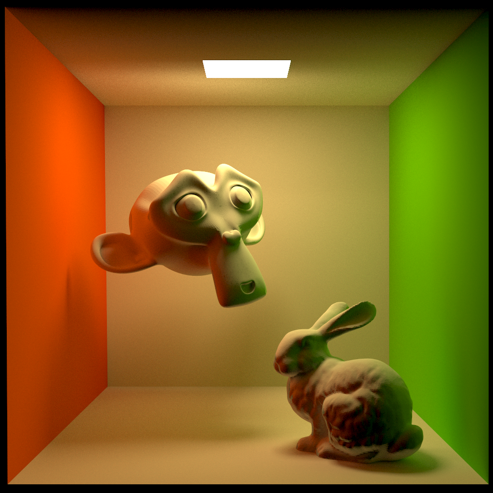
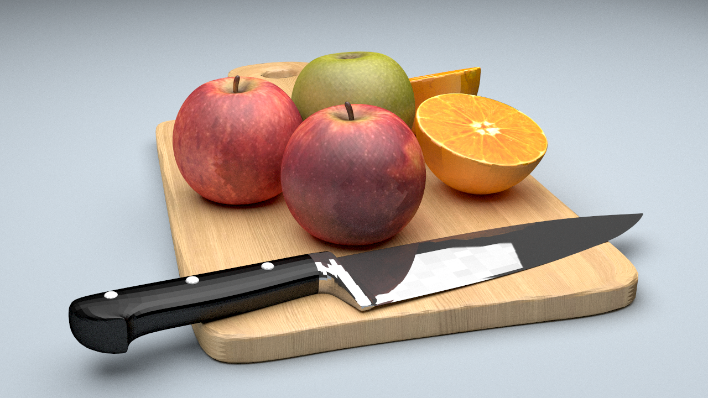

# OpenGL Projects

My OpenGL application programming projects, or templates.

## Build

* CMake 3.22
* C++20
* OpenGL 4.6
* `glslangValidator` in PATH

OpenGL 4.6 is required, which is not supported in MacOS. Windows (msvc) and Linux (gcc) build are  passed.

## Used Thirdparties

Global requirement:

* [cmrc](https://github.com/vector-of-bool/cmrc)

Subproject may has its own thirdparty requirements. See README.md at each subdirctory.

## Screenshots

### Boundary Representation

[brep](./brep/README.md)

### Software Rasterizer

[rasterize](./rasterize/README.md)

### NURBS

[nurbs](./nurbs/README.md)

### Monte Carlo Path Tracer

[pathtrace](./pathtrace/README.md)

### Particle System

[Particle](./particle/README.md)

