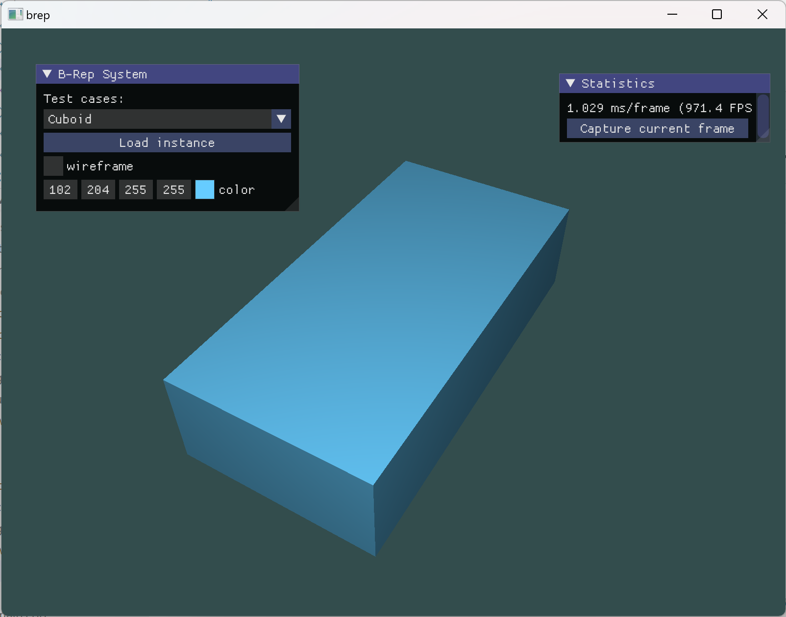
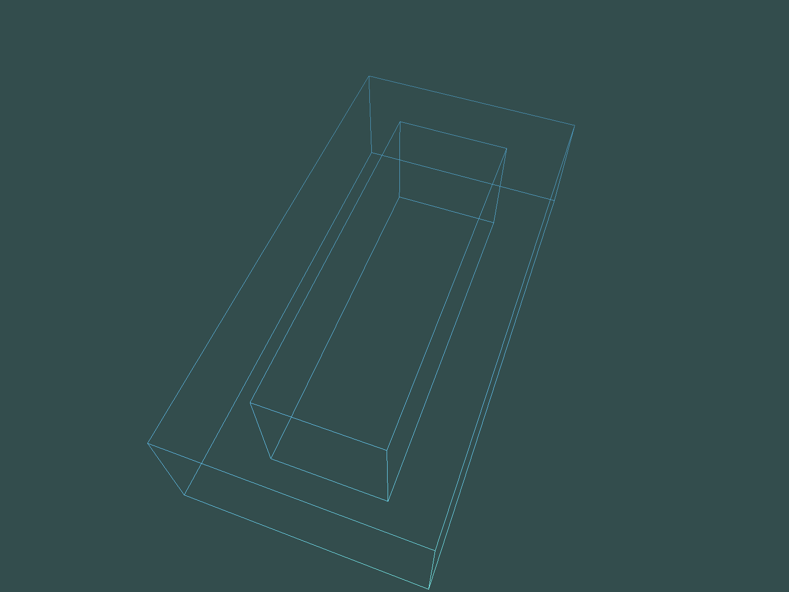
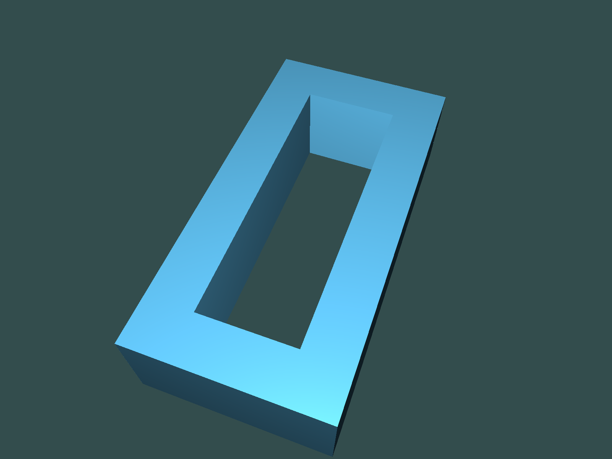
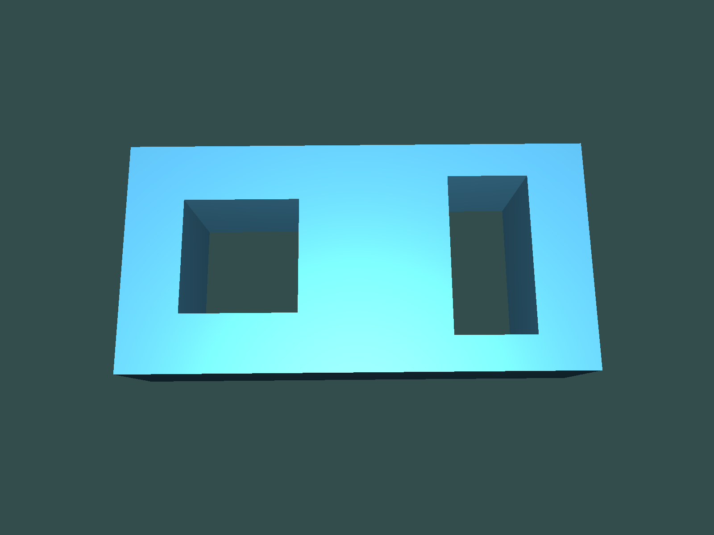
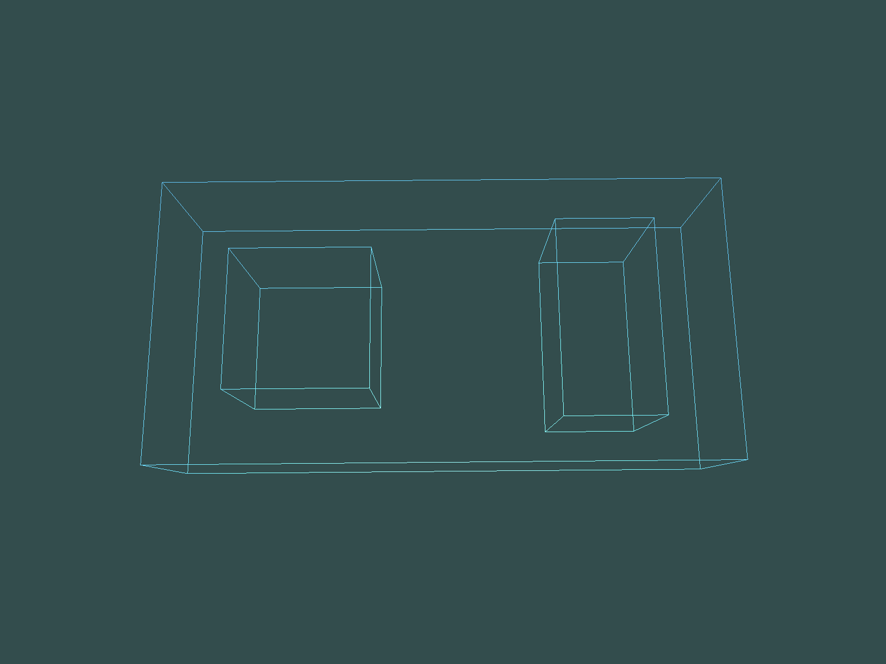
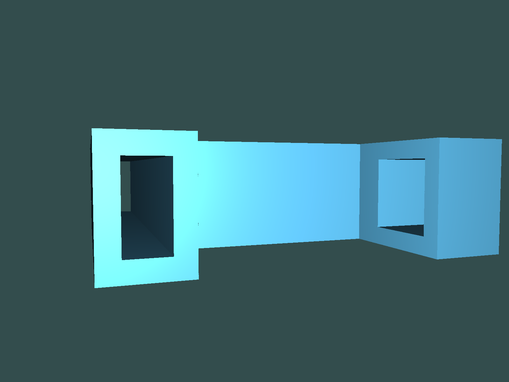
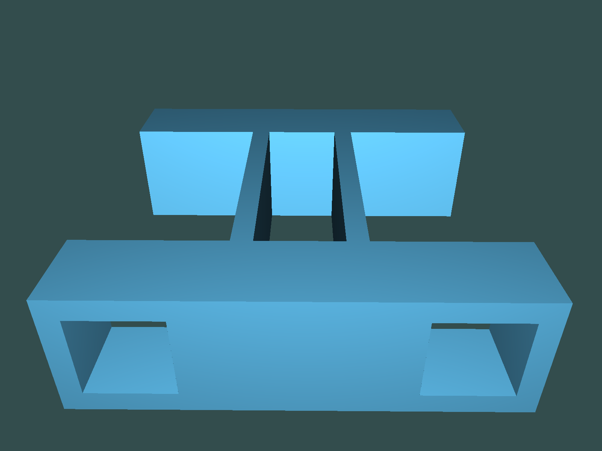
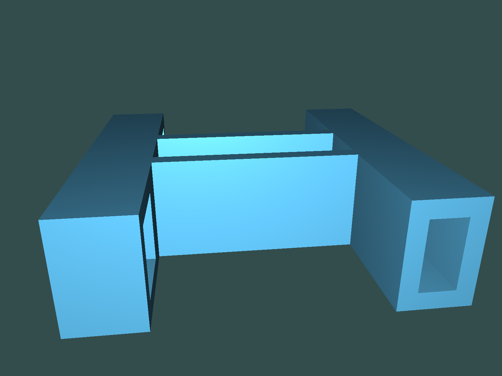
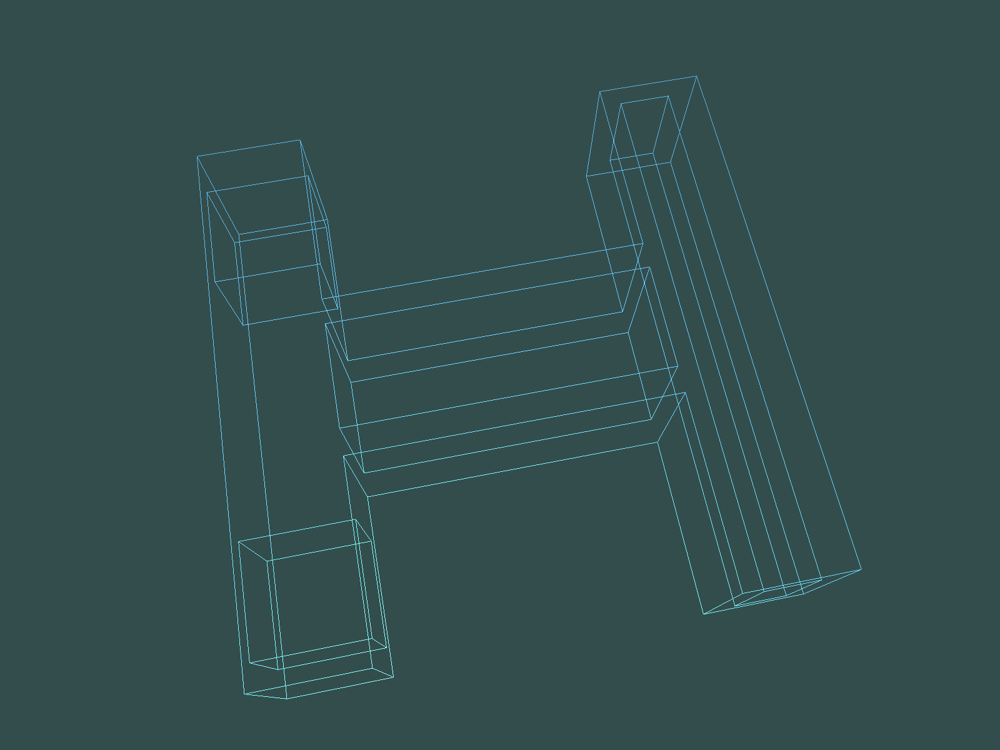

# B-rep System

## Instruction

本大程作业的内容包括：

1）定义半边数据结构（`brep/src/graph/half_edge.cpp` 等）；

2）基于半边数据结构，实现五个基本欧拉操作；

3）基于欧拉操作，实现扫掠操作（必须允许二维区域带多个内环），并将基于扫掠操作构建的实体模型进行真实感图形显示。

## Build

* CMake >=3.22
* C++20
* OpenGL 4.6
* `glslangValidator` in PATH

OpenGL 4.6 is required, which is not supported in MacOS. Windows (msvc) and Linux (gcc) build are  passed.

## Dependencies

My `renderer`, and thirdparties:

* [glad](https://github.com/Dav1dde/glad)
* [glm](https://github.com/g-truc/glm)
* [Dear ImGui](https://github.com/ocornut/imgui)
* [stb image](https://github.com/nothings/stb)
* [poly2tri](https://github.com/jhasse/poly2tri)

All thirdpartiy sources are included in `brep/thirdparty`, which will be built by CMake commands.

## Usage

Select a test case to see the rendered solid:

* Cuboid: a simple cuboid without hole, generated using `sweep`.
* Holed Cuboid: a cuboid with a hole penetrated from top to bottom, generated using the euler operation flow:

```
mvsf
mev ^ 3
mef
mev ^ 4
mef ^ 4
mev ^ 4
mef
kemr
mev ^ 4
mef ^ 4
kfmrh
```

* Double Holed Cuboid: a cuboid with two holes penetrated from top to bottom. It's built from Holed Cuboid with additional hole constructed.
* Complicated Solid: a complicated solid with 4 holes, constructed using multiple operations include `sweep`.

for detailed operations, see `brep/src/dataop/instances.cpp` and `brep/src/dataop/operation.cpp`.

You can toggle wireframed or shaded rendering using the `wireframe` checker in the GUI.

## Rendering Detail

The program uses OpenGL 4.6 to render triangular primitives. To construct triangular mesh from boundary representation, the program uses [poly2tri](https://github.com/jhasse/poly2tri) to perform Constrained Delaunay Triangulation (CDT). See `brep/src/draw.cpp` for detail. The lighting model is a simple Blinn-Phong, see shader files in the folder `shaders/plain` for detail.

## Screenshots

* Cuboid (& GUI)



* Holed Cuboid





* Double Holed Cuboid





* Complicated Solid








