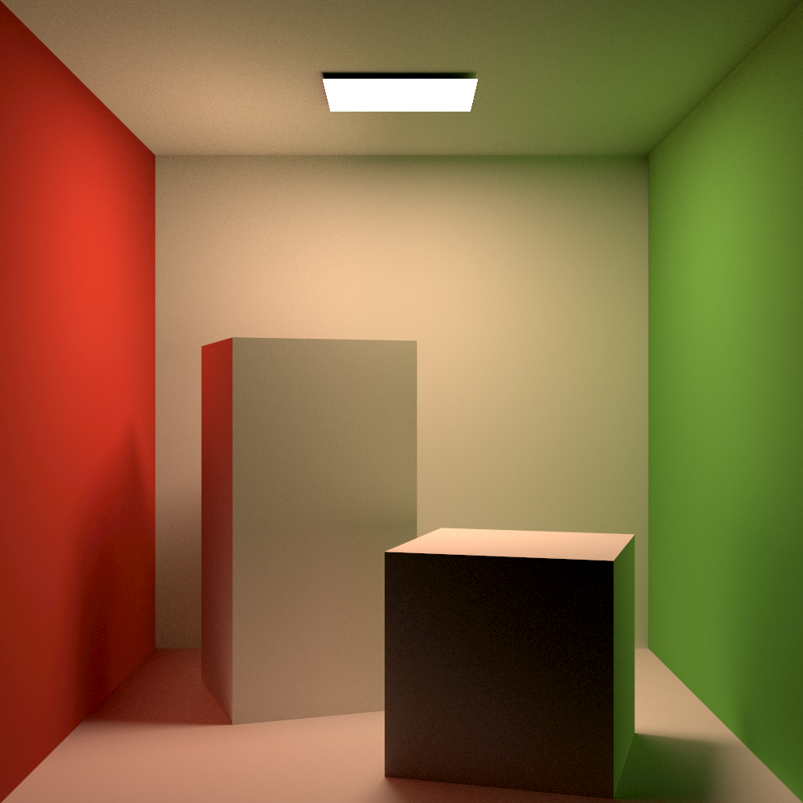
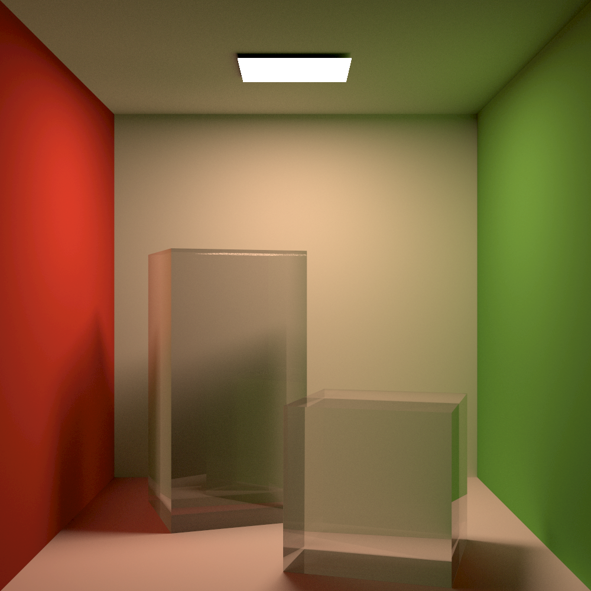
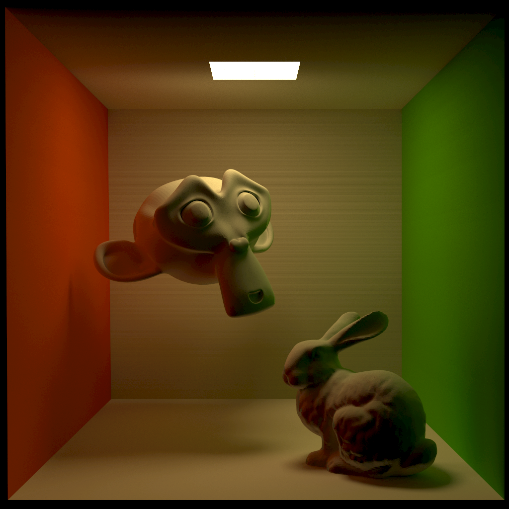
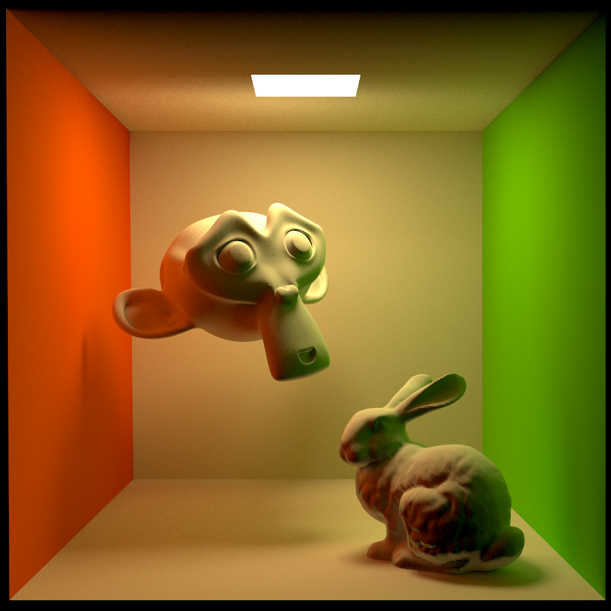
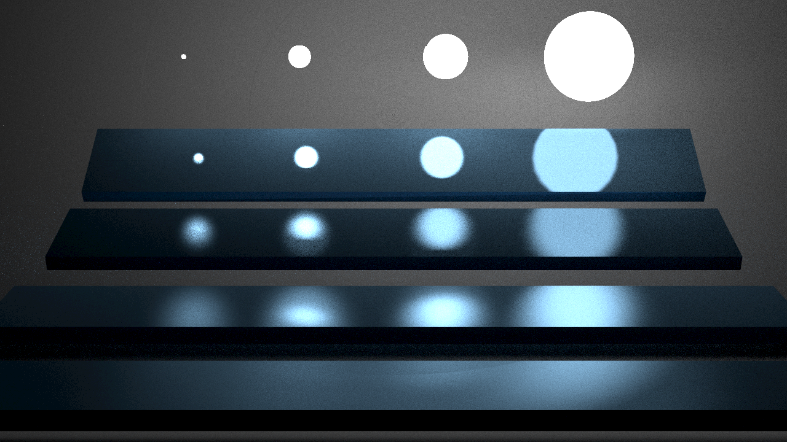
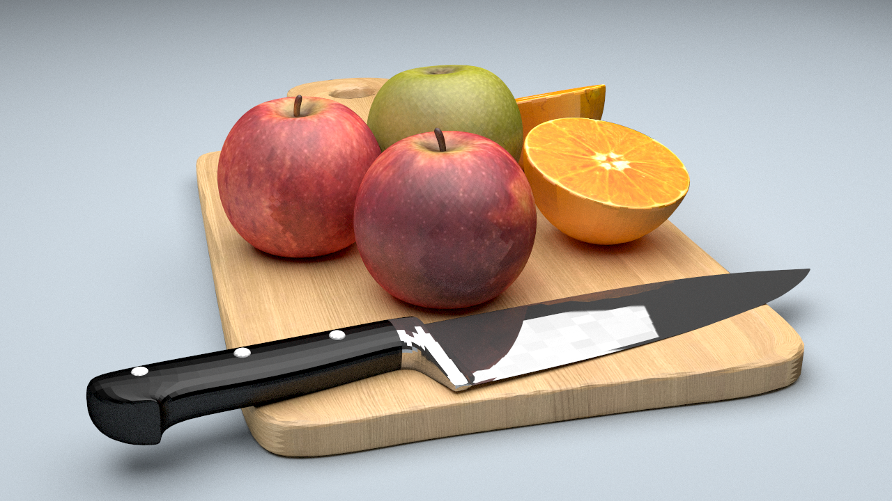
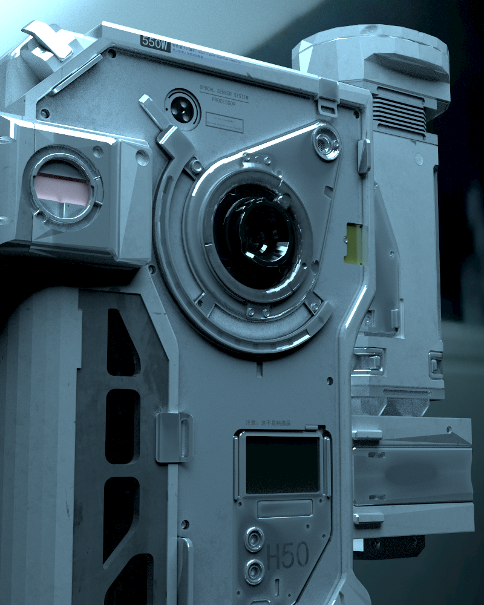
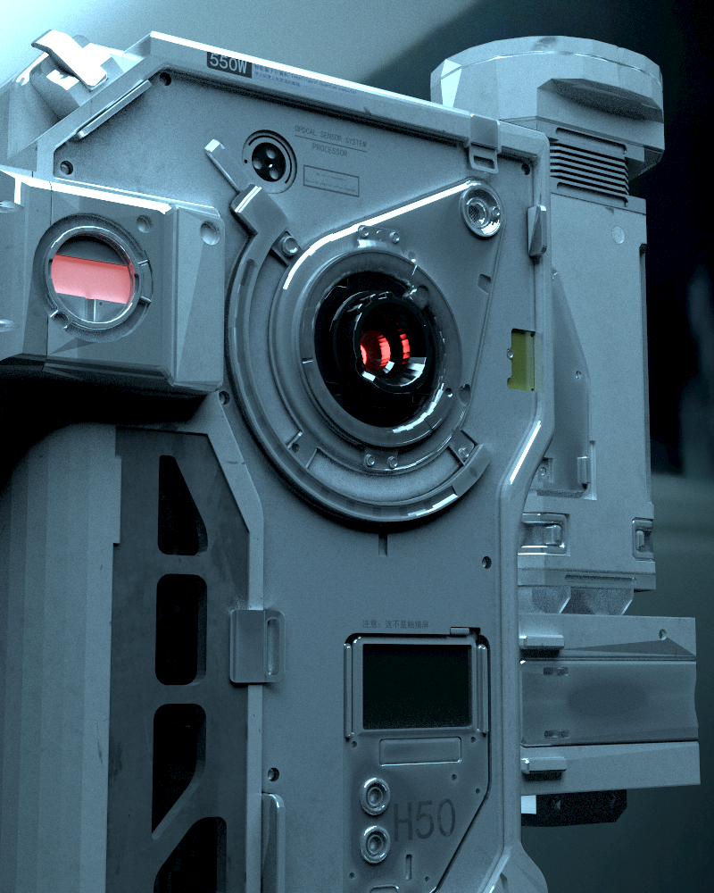
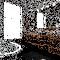

# Monte Carlo Path Tracer

## Description

This is a toy renderer using monte carlo path tracing.

* Multiple Importance Sampling is implemented, to render `veach-mis` scene efficiently.
* Support phong material, serve glass material as a special case.
* Support triangular area lights.
* Support triangular meshes.
* Use a simple BVH to accelerate ray-object intersection query.
* Path tracing on each pixel is parallel using CPU multithreading.

## Build

* CMake >= 3.22
* C++20
* OpenGL 4.6
* `glslangValidator` in PATH

OpenGL 4.6 is required, which is not supported in MacOS. Windows (msvc) and Linux (gcc) build are passed.

### Dependency

My `renderer`, and thirdparties:

* [glad](https://github.com/Dav1dde/glad)
* [glm](https://github.com/g-truc/glm)
* [Dear ImGui](https://github.com/ocornut/imgui)
* [stb image](https://github.com/nothings/stb)

All thirdpartiy sources are included in `thirdparty/`, `renderer/thirdparty/`, which will be built by CMake commands.

## User Interface

1. Select a cached scene, or select a folder to load the model.
   * Scene `classic-cornell-box` and `cornell-box` are cached, i.e., load from memory. Scene `veach-mis`, `bathroom`, `fruit` and `moss` can be loaded from the disk. They are located in the folder `assets/scene`.
2. Click `Load scene` button to load the scene. Then the number of triangles of the scene is shown.
3. You can adjust the camera parameters in the GUI. Default camera parameters is setup automatically when the scene is loaded.
4. Select the number of sampling per pixel (spp), and click the `Render` button to wait for a result. If `update result` is checked, the result of each sample is update real-time to the screen.
5. There is also a screenshot button on the GUI.

## Screenshots and Results

* UI and operation screenshot (GIF)

* Classic cornell box (1000 spp)

* Glass material cornell box (1000 spp)

* Cornell box with suzanne and bunny (1000 spp)

This is the result of original scene:

We can see noisy horizontal black line artifacts in the rendering result. Also, the result is darker than the reference. These artifacts are caused by floating point precision problem, leading the rays fail to sample lights (they hit the non-emissive ceiling rather than the light, since they are too close and misleads the intersection check), making the result darker in color.

If we slightly modify the y-coordinate (height) of the light triangles, i.e., to lower them with a very small offset (`y = 548.8 -> 547.8`), the light sampling process will work as expected. The lighting of the scene becomes good in this case, as shown below:

* Veach-MIS (1000 spp)

2 sampling methods, light and surface material BRDF are verified.

* Fruit (500 spp)

This scene is provided from a senior student in the university.

Weird area artifacts can be seen in the rendering result, which have a deeper color compared with their neighbors (see the highlight part on the knife). The reason that causes such artifacts is still left unknown.

* MOSS (in the film *The Wandering Earth 2*)

The model in this scene is from https://www.aplaybox.com/details/model/aS63d8LVU8U5

Red light Off (1000 spp):

Red light On (1000 spp):

* Bathroom (oops, rendering failed)

This toy renderer cannot render the scene `bathroom` in a reasonable time.

The scene is so complicated that every sample process consumes large time in ray-object intersection query, causing the renderer almost stucks in such a situation. Also, the scene is full of indirect illumination, that the process for a surface point to sample light is difficult, requires multiple bounces in various locations.

To improve this, first, a more efficient BVH should be designed, to allow the renderer to continue path tracing. Second, a bidirectional path tracing scheme should be implmented, and a GPU accleration may be necessary.

Here is a 60 * 60 rendering result (200 spp):

## Conclusion

This renderer is not prepared for large and complicated scene rendering, but is tested correct in the above scene results, except for artifacts caused by floating point numerical error.

There are many spaces for improvement and optimization, though it should be OK to be a homework of a lesson.
