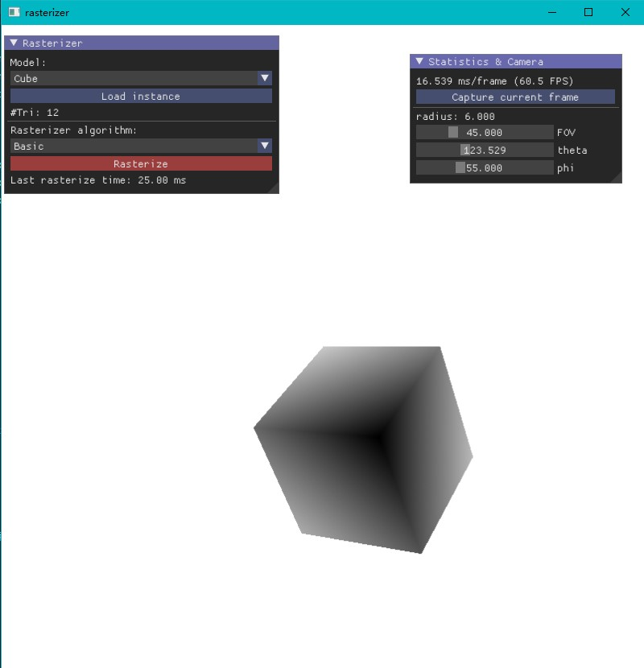
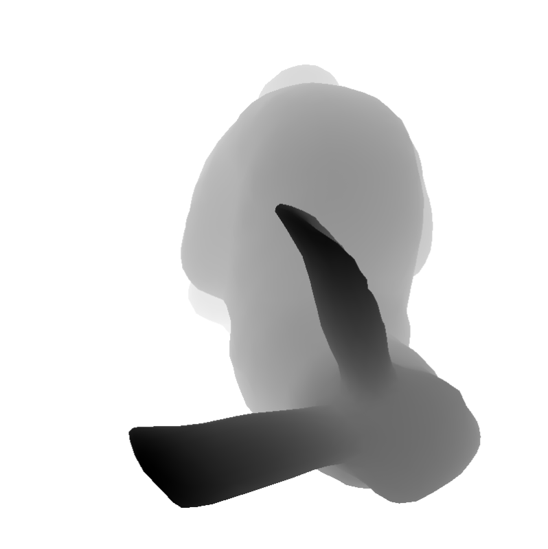

# 遮挡剔除

## 实验内容

上机3：实现层次z-buffer算法(70分)

* 完整模式(层次z-buffer+场景八叉树)
* 分别对比简单模式和完整模式与扫描线z-buffer算法的加速比

## 编程与构建环境

* CMake >=3.22
* C++20
* OpenGL 4.6
* `glslangValidator` in PATH

OpenGL 4.6 is required, which is not supported in MacOS. Windows (msvc) and Linux (gcc) build are passed.

### 依赖

My `renderer`, and thirdparties:

* [glad](https://github.com/Dav1dde/glad)
* [glm](https://github.com/g-truc/glm)
* [Dear ImGui](https://github.com/ocornut/imgui)
* [stb image](https://github.com/nothings/stb)
* [tinyobjloader](https://github.com/tinyobjloader/tinyobjloader) (read `obj` file)

All thirdpartiy sources are included in `brep/thirdparty`, which will be built by CMake commands.

## 用户界面使用说明

1. Select a model and click `Load instance` button to load the model. Then the number of triangles of the model is shown. 5 `obj` models are available by default.
2. Select an algorithm (among basic z-buffer, simple mode Hi-z buffer and complete mode Hi-z buffer) and click `Rasterize` button to rasterize the scene. Last rasterize time is shown after the scene is rasterized.
3. Plus, user can manipulate mouse scroll to change the radius of the orbit camera, and scroll the FOV, theta and phi of the orbit camera on the right side of the GUI.
4. There is also a screenshot button on the right side of the GUI.

Note: the scene is rasterized only if the `Rasterize` button is clicked.

### 截图

* Cube (& GUI)

 {#fig:cube and gui}

* Bunny

 {#fig:bunny}

* Armadillo

 {#fig:armadillo}

* Armadillo (culled testing)

When camera is in front of the plane, the armadillo is occluded and the Hi-z rasterizer has a better performance.

 {#fig:armadillo (culled)}

When camera is behind the plane, the armadillo is rasterzied.

## 算法和数据结构说明

### Basic z-buffer

The basic z-buffer algorithm is implemented in a barycentric way. The algorithm is shown below:

1. For each pixel in the triangle: (use a 2D bounding box)
2. Check if the pixel is in the traingle, if yes:
3. Interpolate the depth value of the pixel using the triangle's barycentric coordinate.
4. Check if the depth is smaller than the known depth, if yes, update the depth value of current pixel.

See `ZBuffer::rasterize(Triangle tri)` for detail.

### Hierarchical z-buffer (image space pyramid)

Hi-z uses depth information from last rasterization, and build a image space pyramid (mipmap) that higher level nodes have depth value equals to the `max` of depth value of its 4 children nodes. i.e.,

where the root node has the maximum depth of the whole scene.

In hierarchical Z-buffer (image space pyramid), first we construct a pyramid using depth value from last rasterization, and foreach triangle, check whether its minimum depth is occluded by querying the pyramid (see `ZBuffer::is_occluded(triangle)`). If yes, discard the triangle to acclerate the rasterization. If no, perform barycentric-based z-buffer algorithm on this triangle.

### Hierarchical z-buffer (image space pyramid + scene space octree)

Complete version of Hi-z uses scene space octree to ensure nearest triangles are rasterized first. The rasterization process is not done by simply iterate over the triangle list. Instead, we build a octree to "sort" all triangles by their depth value and rasterize the nearest triangles first. See `Scene::build_octree_and_rasterize(triangles)` for detail.

The complete version of Hi-z does not outperform simple version of Hi-z, since the depth information is already known in previous rasterzation. The culled triangles are not much matter.  

## 实验结果报告

The experiment is performed in:

* Windows 10 (x64)
* Visual Studio 2022, Release build
* Intel(R) Core(TM) i5-9300H CPU @ 2.40GHz

The z-buffer algorithm is completely executed in CPU, so GPU does not matter.

The experiment is performed in order that `Basic -> Simple Mode Hi-z -> Complete mode Hi-z` in the same scene and camera params. 

| Model / Algo     | #Tri   | Basic (ms)    | Simple Mode Hi-z              | Complete mode Hi-z |
| ---------------- | ------ | ------------- | ----------------------------- | ------------------ |
| Cube             | 12     | **12**  | 40                            | 25                 |
| Bunny            | 4968   | **16**  | 28                            | 29                 |
| Armadillo        | 212574 | **107** | 121                           | 176                |
| Culled Armadillo | 212576 | 175           | **115 (speedup: 1.52)** | 175                |

From the result we can see that: 

* In a usual one-model scene, basic z-buffer algorithm has the best efficiency.
* When the model is occluded (in the test scene Culled Armadillo), refer to @fig:armadillo (culled), the simple mode hi-z algorithm outperforms basic z-buffer by culling most of the triangles. Though complete mode Hi-z still suffers from its slow octree partition process.
* We can expect hi-z algorithm has a good efficiency in a complex scene with many occluders.

## 总结

The scene largely determines which algorithm has a better efficiency. In this project, the scene is so simple that hi-z can't achieve a better performance most of the time. However, for large and complex scenes such as a city in a game, optimization for occlusion is necessary. Therefore, we should focus on the specific project and choose the algorithm smartly.

## 参考文献

Real-Time Rendering 4th Edition

Hierarchical Z-Buffer Visibility. Proceedings of SIGGRAPH '93.  *Published February 1, 1993* . N. Greene, M. Kass, Gavin Miller.
